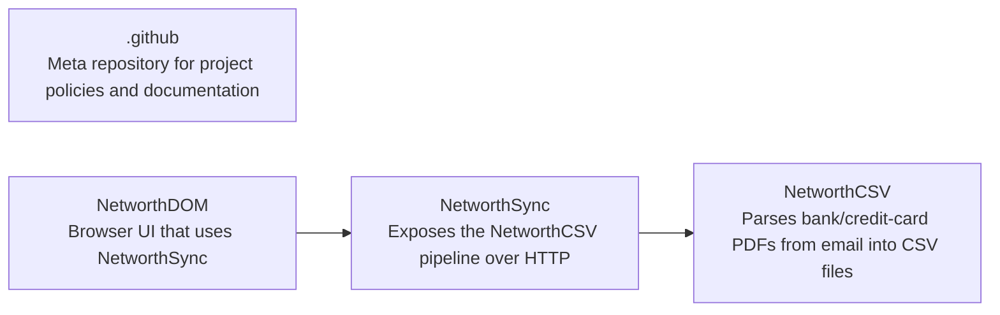

# README

This is a meta repository to manage the entire financial footprints project.

## Repository Relationship

```mermaid
flowchart LR
  github[".github<br/>Meta repository for project policies and documentation"]
  dom["NetworthDOM<br/>Browser UI that uses NetworthSync"]
  sync["NetworthSync<br/>Exposes the NetworthCSV pipeline over HTTP"]
  csv["NetworthCSV<br/>Parses bank/credit-card PDFs from email into CSV files"]

  dom --> sync --> csv
```

| Repository                                                           | Role                       |
| -------------------------------------------------------------------- | -------------------------- |
| [.github](https://github.com/financial-footprints/.github)           | Policies, diagram, LICENSE |
| [NetworthCSV](https://github.com/financial-footprints/NetworthCSV)   | PDF/email → CSV pipeline   |
| [NetworthSync](https://github.com/financial-footprints/NetworthSync) | HTTP API over NetworthCSV  |
| [NetworthDOM](https://github.com/financial-footprints/NetworthDOM)   | Browser UI                 |

## Development

See [CONTRIBUTING.md](docs/CONTRIBUTING.md) for setup, testing, and contribution guidelines.
