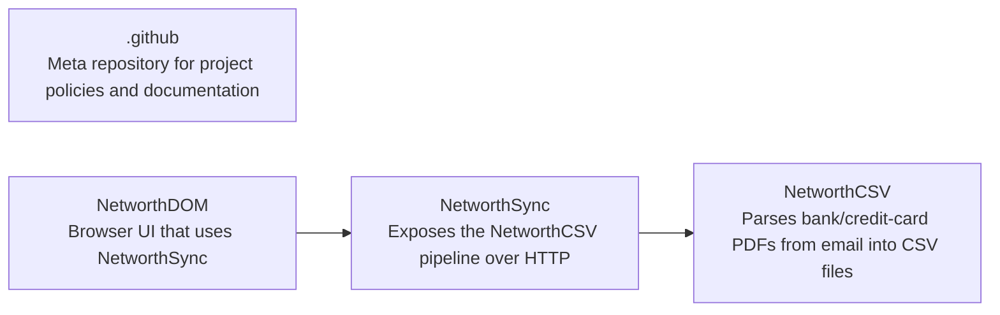

# README

This is a meta repository to manage the entire financial footprints project.

## Repository Relationship


```mermaid
flowchart LR
  github[".github<br/>Meta repository for project policies and documentation"]
  dom["NetworthDOM<br/>Browser UI that uses NetworthSync"]
  sync["NetworthSync<br/>Exposes the NetworthCSV pipeline over HTTP"]
  csv["NetworthCSV<br/>Parses bank/credit-card PDFs from email into CSV files"]

  dom --> sync --> csv
```

| Repository                                                           | Role                       |
| -------------------------------------------------------------------- | -------------------------- |
| [.github](https://github.com/financial-footprints/.github)           | Policies, diagram, LICENSE |
| [NetworthCSV](https://github.com/financial-footprints/NetworthCSV)   | PDF/email → CSV pipeline   |
| [NetworthSync](https://github.com/financial-footprints/NetworthSync) | HTTP API over NetworthCSV  |
| [NetworthDOM](https://github.com/financial-footprints/NetworthDOM)   | Browser UI                 |

## Creating repositories

The following common pattern must be followed:

- Create EditorConfig
- Follow SemVer
- Create README.md
  - Contain Goal & Setup information (at least)
- Must contain LICENSE information
- Must contain tests
- Must contain user & developer documentation
- Must follow microservice architecture
- Contain appropriate CI/CD
  - Enforce code coverage
- Contain automated linting & formatting
- Follow automated commit message guidelines
- Contain appropriate logging & metrics
- Shared editor configurations (eg. .vscode)

## Configure Project

### Prerequisites

- Python 3.11+ with [uv](https://docs.astral.sh/uv/)
- [make](https://www.gnu.org/software/make/) (Python repos)
- [Bun](https://bun.sh/) or npm (NetworthDOM)

### Layout

Clone all repos as siblings under one workspace root:

```bash
mkdir financial-footprints && cd financial-footprints
git clone git@github.com:financial-footprints/.github.git README
git clone git@github.com:financial-footprints/NetworthCSV.git
git clone git@github.com:financial-footprints/NetworthSync.git
git clone git@github.com:financial-footprints/NetworthDOM.git
```

Symlink shared workspace files from the README repo, then open `networth.code-workspace`:

```bash
ln -s README/networth.code-workspace networth.code-workspace
ln -s README/.vscode .vscode
ln -s README/scripts scripts
```

### Setup order

Follow the dependency chain: **NetworthCSV → NetworthSync → NetworthDOM**.

1. **[NetworthCSV](../NetworthCSV/README.md#setup)** — configure `user.config.json` and run the pipeline locally.
2. **[NetworthSync](../NetworthSync/README.md#setup)** — `make dev-install` expects sibling `../NetworthCSV`; copy `.env.example` to `.env`.
3. **[NetworthDOM](../NetworthDOM/README.md#setup)** — install frontend deps and run the dev server.

When changing code, start from the repository you want to modify and work outward, ensuring dependent repos still work after your change.
