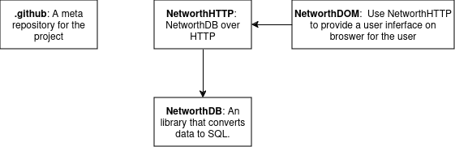

# NetworthMeta

This is a meta repository to manage the entire financial footprints project.

## Repository Relationship

## Creating repositories

The following common pattern must be followed:

- Create EditorConfig
- Follow SemVer
- Create README.md
    - Contain Goal & Setup information (at least)
- Must contain LICENSE information
- Must contain tests
- Must contain user & developer documentation
- Must follow microservice architecture
- Contain appropriate CI/CD
    - Enforce code coverage
- Contain automated linting & formatting
- Follow automated commit message guidelines
- Contain appropriate logging & metrics
- Shared editor configurations (eg. .vscode)

## Configure Project

1. Use the `.vscode` folder at the root of location where you plan to clone the repositories.
2. From the repository relationship diagram, follow that you want to change and start there while ensuring all the dependencies work after your change.

Will document more on this in the future.
