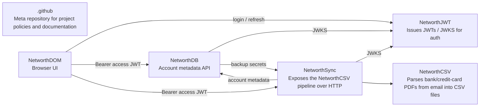

# Contributing

This guide is for developers working on the financial-footprints project. End-user setup and usage live in each repository's [README.md](../README.md).

## Repository Map


```mermaid
flowchart LR
  github[".github<br/>Meta repository for project policies and documentation"]
  dom["NetworthDOM<br/>Browser UI"]
  jwt["NetworthJWT<br/>Issues JWTs / JWKS for auth"]
  db["NetworthDB<br/>Account metadata API"]
  sync["NetworthSync<br/>Exposes the NetworthCSV pipeline over HTTP"]
  csv["NetworthCSV<br/>Parses bank/credit-card PDFs from email into CSV files"]

  dom -->|"login / refresh"| jwt
  dom -->|"Bearer access JWT"| db
  dom -->|"Bearer access JWT"| sync
  db -->|"JWKS"| jwt
  sync -->|"JWKS"| jwt
  sync -->|"account metadata"| db
  db -->|"backup secrets"| sync
  sync --> csv
```

| Repository                                                           | Role                            | Developer Guide                                                                                        |
| -------------------------------------------------------------------- | ------------------------------- | ------------------------------------------------------------------------------------------------------ |
| [.github](https://github.com/financial-footprints/.github)           | Policies, diagram, LICENSE, e2e | This file                                                                                              |
| [NetworthJWT](https://github.com/financial-footprints/NetworthJWT)   | Auth service (JWT issue + JWKS) | [CONTRIBUTING.md](https://github.com/financial-footprints/NetworthJWT/blob/main/docs/CONTRIBUTING.md)  |
| [NetworthDB](https://github.com/financial-footprints/NetworthDB)     | Encrypted account metadata API  | [CONTRIBUTING.md](https://github.com/financial-footprints/NetworthDB/blob/main/docs/CONTRIBUTING.md)   |
| [NetworthCSV](https://github.com/financial-footprints/NetworthCSV)   | PDF/email -> CSV pipeline       | [CONTRIBUTING.md](https://github.com/financial-footprints/NetworthCSV/blob/main/docs/CONTRIBUTING.md)  |
| [NetworthSync](https://github.com/financial-footprints/NetworthSync) | HTTP API over NetworthCSV       | [CONTRIBUTING.md](https://github.com/financial-footprints/NetworthSync/blob/main/docs/CONTRIBUTING.md) |
| [NetworthDOM](https://github.com/financial-footprints/NetworthDOM)   | Browser UI                      | [CONTRIBUTING.md](https://github.com/financial-footprints/NetworthDOM/blob/main/docs/CONTRIBUTING.md)  |

## Prerequisites

- Python 3.11+ with [uv](https://docs.astral.sh/uv/)
- Go 1.22+ (NetworthJWT)
- [make](https://www.gnu.org/software/make/)
- [Bun](https://bun.sh/) (NetworthDB, NetworthDOM, Bruno e2e)
- Node >= 22.14 (NetworthDOM)
- Docker (shared dev Postgres and pgAdmin via `./scripts/dev.sh`)
- `curl` (Bruno stack health checks)
- [Bruno](https://www.usebruno.com/) CLI is installed via `bun install` in this repo (`@usebruno/cli`)

## Environment files

Every service repo ships `.env.example`. Copy it to `.env` locally before install or first run — `.env` is gitignored and must not be committed.

| Repo             | Notes                                                                                                                               |
| ---------------- | ----------------------------------------------------------------------------------------------------------------------------------- |
| **NetworthSync** | **Required before any `make` command** - the Makefile uses `include .env`. Set `STORAGE_MASTER_KEY` before `make dev`.              |
| **NetworthDB**   | Copy before install; set `STORAGE_MASTER_KEY` before `make dev`. `make dev-install` auto-copies when missing.                       |
| **NetworthJWT**  | Copy before `make migrate` / `make dev`. Generate Ed25519 key files (paths in `.env`).                                              |
| **NetworthCSV**  | Also copy `sources.example.json` -> `sources.json` and `accounts.example.json` -> `accounts.json`. Set `DOWNLOAD_PATH` in `.env`.   |
| **NetworthDOM**  | Copy before `make install`. Empty API vars use the Rsbuild dev proxy.                                                               |

Generate a 32-byte storage key for NetworthDB and NetworthSync:

```bash
openssl rand -base64 32 | tr '+/' '-_' | tr -d '='
```

Bruno e2e uses separate `.env.bruno` files — see [Bruno API tests](#bruno-api-tests) below.

Per-repo variable tables and chaining (`ENV_NETWORTH*`, `ENV_PATH`) are in each repository's `docs/CONTRIBUTING.md`.

## Workspace Layout

Clone all repos as siblings under one workspace root:

```bash
mkdir financial-footprints && cd financial-footprints
git clone git@github.com:financial-footprints/.github.git README
git clone git@github.com:financial-footprints/NetworthJWT.git
git clone git@github.com:financial-footprints/NetworthDB.git
git clone git@github.com:financial-footprints/NetworthCSV.git
git clone git@github.com:financial-footprints/NetworthSync.git
git clone git@github.com:financial-footprints/NetworthDOM.git
```

Symlink shared workspace files from the README repo, then open `networth.code-workspace`:

```bash
ln -s README/workspaces/networth.code-workspace networth.code-workspace
ln -s README/.vscode .vscode
ln -s README/scripts scripts
```

### IDE / Python interpreters

Open the workspace via the symlink at the workspace root (`networth.code-workspace`), not the file under `README/workspaces/` directly.

Each Python repo (**NetworthCSV**, **NetworthSync**) has its own `.venv`. Create them before expecting IntelliSense:

```bash
cd NetworthCSV
cp .env.example .env   # plus sources.json and accounts.json — see NetworthCSV CONTRIBUTING.md
make install

cd ../NetworthSync
cp .env.example .env   # required before any make target in NetworthSync
make install           # or make dev-install for editable NetworthCSV
```

The workspace pins each Python folder to `${workspaceFolder}/.venv/bin/python`. Non-Python folders disable Python analysis so the extension does not probe them for a venv.

If you still see **Invalid Python interpreter** after `make install`:

1. **Developer: Reload Window**
2. **Python: Clear Workspace Interpreter Setting**, then **Python: Select Interpreter** and pick the `.venv` for the active folder

## Setup Order

Follow the pipeline chain: **NetworthCSV → NetworthJWT + NetworthDB → NetworthSync → NetworthDOM**.

The fastest path is [`scripts/dev.sh`](../scripts/dev.sh) from the workspace root: it opens four terminal tabs (JWT, DB, Sync, DOM) that each run [`init.sh --dev`](../scripts/init.sh) (env files, Docker infra, dependencies) and `make dev`.

Manual setup (same ports):

1. **[NetworthCSV](https://github.com/financial-footprints/NetworthCSV/blob/main/docs/CONTRIBUTING.md)** — copy `.env`, `sources.json`, and `accounts.json` from the example files; set `DOWNLOAD_PATH` in `.env`; `make install`.
2. Start shared Postgres: `./scripts/dev.sh` (or `docker compose -f README/deploy/docker-compose.dev.yml up -d --wait`).
3. **[NetworthJWT](https://github.com/financial-footprints/NetworthJWT/blob/main/docs/CONTRIBUTING.md)** — copy `.env.example` to `.env`, generate Ed25519 keys, `make migrate`, `make createuser`, `make dev` (`127.0.0.1:8100`, Postgres database `networthjwt`).
4. **[NetworthDB](https://github.com/financial-footprints/NetworthDB/blob/main/docs/CONTRIBUTING.md)** — copy `.env.example` to `.env`, set `STORAGE_MASTER_KEY`, `make dev-install`, `make dev` (`127.0.0.1:8200`).
5. **[NetworthSync](https://github.com/financial-footprints/NetworthSync/blob/main/docs/CONTRIBUTING.md)** — copy `.env.example` to `.env` (required before any `make` target); set `STORAGE_MASTER_KEY`; `make dev-install` (expects sibling `../NetworthCSV`); `make dev` (`127.0.0.1:8000`, Postgres database `networthsync`).
6. **[NetworthDOM](https://github.com/financial-footprints/NetworthDOM/blob/main/docs/CONTRIBUTING.md)** — copy `.env.example` to `.env`; `make install`; `make dev` (`127.0.0.1:3000`).

Stop the dev stack and clean build artifacts: `./scripts/cleanup.sh` (or `./scripts/dev.sh --down` for Docker containers only).

If you previously ran the old Drizzle Studio stack, remove its Docker image once after pulling this change (no Postgres volume reset needed):

```bash
cd README
./scripts/dev.sh --down
docker compose -f deploy/docker-compose.dev.yml down --rmi local --remove-orphans
docker rmi networth-dev-drizzle-studio 2>/dev/null || true
```

When changing code, start from the repository you want to modify and work outward, ensuring dependent repos still work after your change.

## Org Standards

Every repository in this project follows these conventions:

- **EditorConfig** — consistent formatting across editors
- **SemVer** — version numbers follow [Semantic Versioning](https://semver.org/)
- **README.md** — goal, setup, and usage for end users
- **docs/CONTRIBUTING.md** — developer setup, testing, and contribution guidelines
- **LICENSE** — license file included in each repo
- **Tests** — unit tests required; run via `make check` or `make ci`
- **Test/prod split** — test-only helpers (DB reset, fake auth, JWKS injection, env cache reset) live under `tests/` (or `src/tests/support/` in Go). Do not add `*test*`, `*Test*`, or `for tests` APIs to production `src/`
- **CI** — run `make check` before submitting changes; use `make ci` for read-only verification in a single repo, or `./scripts/tests/check.sh` to run `make check` across repos
- **Linting & formatting** — Python repos use [basedpyright](https://docs.basedpyright.com/) and [ruff](https://docs.astral.sh/ruff/); NetworthDOM and NetworthDB use [Biome](https://biomejs.dev/); NetworthJWT uses `gofmt` and `go vet`
- **Microservice architecture** — each repo is an independently deployable component
- **Logging & metrics** — appropriate observability for production use
- **Shared editor config** — open [`workspaces/networth.code-workspace`](../workspaces/networth.code-workspace) (or [`auth.code-workspace`](../workspaces/auth.code-workspace) for DOM + JWT) for workspace-wide extension recommendations; each repository’s `.vscode/` holds stack-specific formatter and LSP settings (Python: cursorpyright + Ruff; TypeScript: Biome + Bun; Go: gopls). Optionally symlink [`.vscode`](../.vscode) at the workspace root for the same extension list when not using a `.code-workspace` file.

## Shared Scripts

After symlinking `scripts/` from this repo, run these from the workspace root:

| Script                                                | Description                                                                                                                                                                                                                                                                                                                                             |
| ----------------------------------------------------- | ------------------------------------------------------------------------------------------------------------------------------------------------------------------------------------------------------------------------------------------------------------------------------------------------------------------------------------------------------- |
| [`scripts/dev.sh`](../scripts/dev.sh)                 | Start shared Postgres + pgAdmin, then open xfce4-terminal tabs for JWT, DB, Sync, and DOM (`init.sh` then `make dev` in each). Use `--down` to stop Postgres and pgAdmin. pgAdmin UI: `http://127.0.0.1:8300` (login `dev@example.com` / `admin`).                                                                                                                                                                                 |
| [`scripts/tests/check.sh`](../scripts/tests/check.sh) | Run `make check` across repos in order (`jwt`, `csv`, `sync`, `db`, `dom`). Runs [`init.sh`](../scripts/init.sh) per repo first (env files, Docker when needed, dependencies). When `jwt`, `db`, and `sync` are all included, runs Bruno e2e at the end. Pass repo names to limit scope, e.g. `./scripts/tests/check.sh jwt db`.                        |
| [`scripts/init.sh`](../scripts/init.sh)               | Copies example env/config files when missing, starts required Docker services (Postgres, Valkey, pgAdmin), creates Postgres databases from `.env` / `.env.test` when missing, and runs `make install` or `make dev-install` for one repo (`--repo db`, `--cwd /path/to/NetworthDB`, or `--dev` for the full dev stack). Used by `dev.sh` and `check.sh`. |
| [`scripts/cleanup.sh`](../scripts/cleanup.sh)         | Stop Bruno e2e and everyday dev servers, stop shared Docker containers (images kept), and run `make clean` in each repo. Use `--infra` for Docker containers only.                                                                                                                                                                                      |
| [`scripts/tests/e2e.sh`](../scripts/tests/e2e.sh)     | Isolated Bruno API tests for JWT, DB, and Sync. Invoked automatically by `check.sh` when those three repos are checked; can also be run standalone.                                                                                                                                                                                                     |
| [`scripts/push.sh`](../scripts/push.sh)               | Add, commit, and push across repos. Run `./scripts/push.sh --help` for options.                                                                                                                                                                                                                                                                         |

## Bruno API tests

HTTP contract tests live in [`bruno/`](../bruno/) because they need JWT, DB, and Sync running together. They use a **separate stack** so everyday `make dev` on ports `8100` / `8200` / `8000` is left alone:

| Service      | Env file     | Port  | Data                                   |
| ------------ | ------------ | ----- | -------------------------------------- |
| NetworthJWT  | `.env.bruno` | 18100 | Postgres database `networthjwt_bruno`  |
| NetworthDB   | `.env.bruno` | 18200 | Postgres database `networthdb_bruno`   |
| NetworthSync | `.env.bruno` | 18000 | Postgres database `networthsync_bruno` |

Copy `.env.bruno.example` to `.env.bruno` in each service repo (`make dev-install` does this for DB and Sync). `make e2e` loads that file via `ENV_NETWORTH*` — no `BRUNO_*` mapping in the Makefile.

Generate JWT signing keys and set `ED25519_PRIVATE_KEY_PATH` / `ED25519_PUBLIC_KEY_PATH` in `NetworthJWT/.env.bruno`. Then from the workspace root:

```bash
chmod +x scripts/tests/e2e.sh
./scripts/tests/e2e.sh
```

That command resets the isolated databases, starts the three APIs, seeds users (`admin` / `alice` / `manager` / `mfa_user`) plus a sample account, runs `bru run --env generated`, and stops only the Bruno-stack processes.

Useful subcommands:

```bash
./scripts/tests/e2e.sh setup
./scripts/tests/e2e.sh seed
./scripts/tests/e2e.sh run
./scripts/tests/e2e.sh down
```

`./scripts/tests/check.sh` runs per-repo `make check` and, when `jwt`, `db`, and `sync` are all in scope, Bruno e2e at the end. Per-repo `make check` alone does not start the e2e stack.

Out of scope for Bruno: WebAuthn ceremony success, live SMTP, live Firefly III, IMAP/Thunderbird, and completed PDF→CSV pipeline jobs. Those paths are covered as HTTP status contracts only.

## Per-Repo Guides

- [NetworthJWT CONTRIBUTING.md](https://github.com/financial-footprints/NetworthJWT/blob/main/docs/CONTRIBUTING.md)
- [NetworthDB CONTRIBUTING.md](https://github.com/financial-footprints/NetworthDB/blob/main/docs/CONTRIBUTING.md)
- [NetworthCSV CONTRIBUTING.md](https://github.com/financial-footprints/NetworthCSV/blob/main/docs/CONTRIBUTING.md)
- [NetworthSync CONTRIBUTING.md](https://github.com/financial-footprints/NetworthSync/blob/main/docs/CONTRIBUTING.md)
- [NetworthDOM CONTRIBUTING.md](https://github.com/financial-footprints/NetworthDOM/blob/main/docs/CONTRIBUTING.md)

## Commit Messages

This project follows the [Conventional Commits](https://www.conventionalcommits.org/en/v1.0.0/) specification. Read the spec for format, types, and breaking-change notation.
