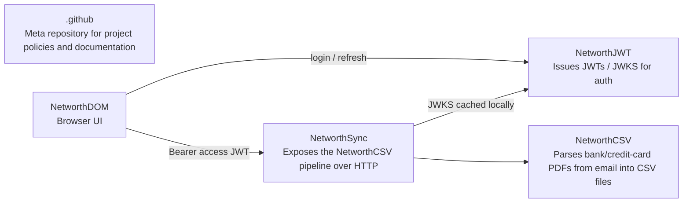

# Contributing

This guide is for developers working on the financial-footprints project. End-user setup and usage live in each repository's [README.md](../README.md).

## Repository Map


```mermaid
flowchart LR
  github[".github<br/>Meta repository for project policies and documentation"]
  dom["NetworthDOM<br/>Browser UI"]
  jwt["NetworthJWT<br/>Issues JWTs / JWKS for auth"]
  sync["NetworthSync<br/>Exposes the NetworthCSV pipeline over HTTP"]
  csv["NetworthCSV<br/>Parses bank/credit-card PDFs from email into CSV files"]

  dom -->|"login / refresh"| jwt
  dom -->|"Bearer access JWT"| sync
  sync -->|"JWKS cached locally"| jwt
  sync --> csv
```

| Repository                                                           | Role                            | Developer Guide                                                                                        |
| -------------------------------------------------------------------- | ------------------------------- | ------------------------------------------------------------------------------------------------------ |
| [.github](https://github.com/financial-footprints/.github)           | Policies, diagram, LICENSE      | This file                                                                                              |
| [NetworthJWT](https://github.com/financial-footprints/NetworthJWT)   | Auth service (JWT issue + JWKS) | [CONTRIBUTING.md](https://github.com/financial-footprints/NetworthJWT/blob/main/docs/CONTRIBUTING.md)  |
| [NetworthCSV](https://github.com/financial-footprints/NetworthCSV)   | PDF/email → CSV pipeline        | [CONTRIBUTING.md](https://github.com/financial-footprints/NetworthCSV/blob/main/docs/CONTRIBUTING.md)  |
| [NetworthSync](https://github.com/financial-footprints/NetworthSync) | HTTP API over NetworthCSV       | [CONTRIBUTING.md](https://github.com/financial-footprints/NetworthSync/blob/main/docs/CONTRIBUTING.md) |
| [NetworthDOM](https://github.com/financial-footprints/NetworthDOM)   | Browser UI                      | [CONTRIBUTING.md](https://github.com/financial-footprints/NetworthDOM/blob/main/docs/CONTRIBUTING.md)  |

## Prerequisites

- Python 3.11+ with [uv](https://docs.astral.sh/uv/)
- Go 1.22+ (NetworthJWT)
- [make](https://www.gnu.org/software/make/) (Python and Go repos)
- [Bun](https://bun.sh/) or npm (NetworthDOM)
- Node >= 22.14 (NetworthDOM)

## Workspace Layout

Clone all repos as siblings under one workspace root:

```bash
mkdir financial-footprints && cd financial-footprints
git clone git@github.com:financial-footprints/.github.git README
git clone git@github.com:financial-footprints/NetworthJWT.git
git clone git@github.com:financial-footprints/NetworthCSV.git
git clone git@github.com:financial-footprints/NetworthSync.git
git clone git@github.com:financial-footprints/NetworthDOM.git
```

Symlink shared workspace files from the README repo, then open `networth.code-workspace`:

```bash
ln -s README/active.code-workspace active.code-workspace
ln -s README/.vscode .vscode
ln -s README/scripts scripts
```

## Setup Order

Follow the pipeline chain: **NetworthCSV → NetworthSync → NetworthDOM**.

**NetworthJWT** is independent of that chain (no dependency on CSV/Sync). Set it up whenever you need login tokens or JWKS verification.

1. **[NetworthCSV](https://github.com/financial-footprints/NetworthCSV/blob/main/docs/CONTRIBUTING.md)** — install dev dependencies and configure local pipeline runs.
2. **[NetworthSync](https://github.com/financial-footprints/NetworthSync/blob/main/docs/CONTRIBUTING.md)** — `make dev-install` expects sibling `../NetworthCSV`; copy `.env.example` to `.env`.
3. **[NetworthDOM](https://github.com/financial-footprints/NetworthDOM/blob/main/docs/CONTRIBUTING.md)** — install frontend deps and run the dev server.
4. **[NetworthJWT](https://github.com/financial-footprints/NetworthJWT/blob/main/docs/CONTRIBUTING.md)** — `go mod tidy`, copy `.env.example` to `.env`, `make run`.

When changing code, start from the repository you want to modify and work outward, ensuring dependent repos still work after your change.

## Org Standards

Every repository in this project follows these conventions:

- **EditorConfig** — consistent formatting across editors
- **SemVer** — version numbers follow [Semantic Versioning](https://semver.org/)
- **README.md** — goal, setup, and usage for end users
- **docs/CONTRIBUTING.md** — developer setup, testing, and contribution guidelines
- **LICENSE** — license file included in each repo
- **Tests** — unit tests required; run via `make check` or `make ci`
- **CI** — run `make check` before submitting changes; use `make ci` for read-only verification in a single repo, or `./scripts/check.sh` to run `make check` across repos
- **Linting & formatting** — Python repos use [basedpyright](https://docs.basedpyright.com/) and [ruff](https://docs.astral.sh/ruff/); NetworthDOM uses [Biome](https://biomejs.dev/); NetworthJWT uses `gofmt` and `go vet`
- **Microservice architecture** — each repo is an independently deployable component
- **Logging & metrics** — appropriate observability for production use
- **Shared editor config** — symlink `.vscode` from this repo for recommended extensions

## Shared Scripts

After symlinking `scripts/` from this repo, run these from the workspace root:

| Script                                    | Description                                                                                                                               |
| ----------------------------------------- | ----------------------------------------------------------------------------------------------------------------------------------------- |
| [`scripts/check.sh`](../scripts/check.sh) | Run `make check` across repos in order (`jwt`, `csv`, `sync`, `dom`). Pass repo names to limit scope, e.g. `./scripts/check.sh jwt sync`. |
| [`scripts/push.sh`](../scripts/push.sh)   | Add, commit, and push across repos. Run `./scripts/push.sh --help` for options.                                                           |

## Per-Repo Guides

- [NetworthJWT CONTRIBUTING.md](https://github.com/financial-footprints/NetworthJWT/blob/main/docs/CONTRIBUTING.md)
- [NetworthCSV CONTRIBUTING.md](https://github.com/financial-footprints/NetworthCSV/blob/main/docs/CONTRIBUTING.md)
- [NetworthSync CONTRIBUTING.md](https://github.com/financial-footprints/NetworthSync/blob/main/docs/CONTRIBUTING.md)
- [NetworthDOM CONTRIBUTING.md](https://github.com/financial-footprints/NetworthDOM/blob/main/docs/CONTRIBUTING.md)

## Commit Messages

This project follows the [Conventional Commits](https://www.conventionalcommits.org/en/v1.0.0/) specification. Read the spec for format, types, and breaking-change notation.
