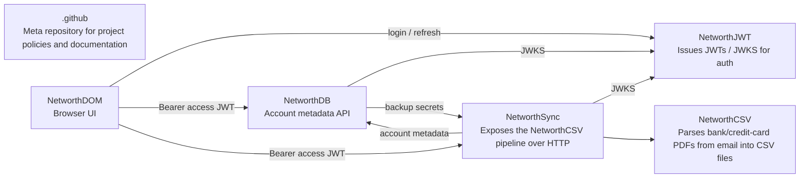

# Contributing

This guide is for developers working on the financial-footprints project. End-user setup and usage live in each repository's [README.md](../README.md).

## Repository Map


```mermaid
flowchart LR
  github[".github<br/>Meta repository for project policies and documentation"]
  dom["NetworthDOM<br/>Browser UI"]
  jwt["NetworthJWT<br/>Issues JWTs / JWKS for auth"]
  db["NetworthDB<br/>Account metadata API"]
  sync["NetworthSync<br/>Exposes the NetworthCSV pipeline over HTTP"]
  csv["NetworthCSV<br/>Parses bank/credit-card PDFs from email into CSV files"]

  dom -->|"login / refresh"| jwt
  dom -->|"Bearer access JWT"| db
  dom -->|"Bearer access JWT"| sync
  db -->|"JWKS"| jwt
  sync -->|"JWKS"| jwt
  sync -->|"account metadata"| db
  db -->|"backup secrets"| sync
  sync --> csv
```

| Repository                                                           | Role                            | Developer Guide                                                                                        |
| -------------------------------------------------------------------- | ------------------------------- | ------------------------------------------------------------------------------------------------------ |
| [.github](https://github.com/financial-footprints/.github)           | Policies, diagram, LICENSE, e2e | This file                                                                                              |
| [NetworthJWT](https://github.com/financial-footprints/NetworthJWT)   | Auth service (JWT issue + JWKS) | [CONTRIBUTING.md](https://github.com/financial-footprints/NetworthJWT/blob/main/docs/CONTRIBUTING.md)  |
| [NetworthDB](https://github.com/financial-footprints/NetworthDB)     | Encrypted account metadata API  | [CONTRIBUTING.md](https://github.com/financial-footprints/NetworthDB/blob/main/docs/CONTRIBUTING.md)   |
| [NetworthCSV](https://github.com/financial-footprints/NetworthCSV)   | PDF/email → CSV pipeline        | [CONTRIBUTING.md](https://github.com/financial-footprints/NetworthCSV/blob/main/docs/CONTRIBUTING.md)  |
| [NetworthSync](https://github.com/financial-footprints/NetworthSync) | HTTP API over NetworthCSV       | [CONTRIBUTING.md](https://github.com/financial-footprints/NetworthSync/blob/main/docs/CONTRIBUTING.md) |
| [NetworthDOM](https://github.com/financial-footprints/NetworthDOM)   | Browser UI                      | [CONTRIBUTING.md](https://github.com/financial-footprints/NetworthDOM/blob/main/docs/CONTRIBUTING.md)  |

## Prerequisites

- Python 3.11+ with [uv](https://docs.astral.sh/uv/)
- Go 1.22+ (NetworthJWT)
- [make](https://www.gnu.org/software/make/)
- [Bun](https://bun.sh/) (NetworthDB, NetworthDOM, Bruno e2e)
- Node >= 22.14 (NetworthDOM)
- Docker (NetworthDB Postgres)
- `curl` (Bruno stack health checks)
- [Bruno](https://www.usebruno.com/) CLI is installed via `bun install` in this repo (`@usebruno/cli`)

## Workspace Layout

Clone all repos as siblings under one workspace root:

```bash
mkdir financial-footprints && cd financial-footprints
git clone git@github.com:financial-footprints/.github.git README
git clone git@github.com:financial-footprints/NetworthJWT.git
git clone git@github.com:financial-footprints/NetworthDB.git
git clone git@github.com:financial-footprints/NetworthCSV.git
git clone git@github.com:financial-footprints/NetworthSync.git
git clone git@github.com:financial-footprints/NetworthDOM.git
```

Symlink shared workspace files from the README repo, then open `networth.code-workspace`:

```bash
ln -s README/workspaces/networth.code-workspace networth.code-workspace
ln -s README/.vscode .vscode
ln -s README/scripts scripts
```

## Setup Order

Follow the pipeline chain: **NetworthCSV → NetworthJWT + NetworthDB → NetworthSync → NetworthDOM**.

1. **[NetworthCSV](https://github.com/financial-footprints/NetworthCSV/blob/main/docs/CONTRIBUTING.md)** — install dev dependencies and configure local pipeline runs.
2. **[NetworthJWT](https://github.com/financial-footprints/NetworthJWT/blob/main/docs/CONTRIBUTING.md)** — copy `.env.example` to `.env`, generate Ed25519 keys, `make migrate`, `make createuser`, `make dev` (`127.0.0.1:8100`).
3. **[NetworthDB](https://github.com/financial-footprints/NetworthDB/blob/main/docs/CONTRIBUTING.md)** — copy `.env.example` to `.env`, set `STORAGE_MASTER_KEY`, `make dev-install`, `make dev` (`127.0.0.1:8200`, Postgres on `5450`).
4. **[NetworthSync](https://github.com/financial-footprints/NetworthSync/blob/main/docs/CONTRIBUTING.md)** — `make dev-install` expects sibling `../NetworthCSV`; copy `.env.example` to `.env`; `make dev` (`127.0.0.1:8000`).
5. **[NetworthDOM](https://github.com/financial-footprints/NetworthDOM/blob/main/docs/CONTRIBUTING.md)** — install frontend deps and run the dev server (`127.0.0.1:3000`).

When changing code, start from the repository you want to modify and work outward, ensuring dependent repos still work after your change.

## Org Standards

Every repository in this project follows these conventions:

- **EditorConfig** — consistent formatting across editors
- **SemVer** — version numbers follow [Semantic Versioning](https://semver.org/)
- **README.md** — goal, setup, and usage for end users
- **docs/CONTRIBUTING.md** — developer setup, testing, and contribution guidelines
- **LICENSE** — license file included in each repo
- **Tests** — unit tests required; run via `make check` or `make ci`
- **CI** — run `make check` before submitting changes; use `make ci` for read-only verification in a single repo, or `./scripts/check.sh` to run `make check` across repos
- **Linting & formatting** — Python repos use [basedpyright](https://docs.basedpyright.com/) and [ruff](https://docs.astral.sh/ruff/); NetworthDOM and NetworthDB use [Biome](https://biomejs.dev/); NetworthJWT uses `gofmt` and `go vet`
- **Microservice architecture** — each repo is an independently deployable component
- **Logging & metrics** — appropriate observability for production use
- **Shared editor config** — symlink `.vscode` from this repo for recommended extensions

## Shared Scripts

After symlinking `scripts/` from this repo, run these from the workspace root:

| Script                                    | Description                                                                                                                                                                                                             |
| ----------------------------------------- | ----------------------------------------------------------------------------------------------------------------------------------------------------------------------------------------------------------------------- |
| [`scripts/check.sh`](../scripts/check.sh) | Run `make check` across repos in order (`jwt`, `csv`, `sync`, `db`, `dom`). When `jwt`, `db`, and `sync` are all included, runs Bruno e2e at the end. Pass repo names to limit scope, e.g. `./scripts/check.sh jwt db`. |
| [`scripts/e2e.sh`](../scripts/e2e.sh)     | Isolated Bruno API tests for JWT, DB, and Sync. Invoked automatically by `check.sh` when those three repos are checked; can also be run standalone.                                                                     |
| [`scripts/push.sh`](../scripts/push.sh)   | Add, commit, and push across repos. Run `./scripts/push.sh --help` for options.                                                                                                                                         |

## Bruno API tests

HTTP contract tests live in [`bruno/`](../bruno/) because they need JWT, DB, and Sync running together. They use a **separate stack** so everyday `make dev` on ports `8100` / `8200` / `8000` is left alone:

| Service      | Env file     | Port  | Data                                 |
| ------------ | ------------ | ----- | ------------------------------------ |
| NetworthJWT  | `.env.bruno` | 18100 | SQLite `./data/networthjwt.test.db`  |
| NetworthDB   | `.env.bruno` | 18200 | Postgres database `networthdb_bruno` |
| NetworthSync | `.env.bruno` | 18000 | SQLite `./data/networthsync.test.db` |

Copy `.env.bruno.example` to `.env.bruno` in each service repo (`make dev-install` does this for DB and Sync). `make e2e` loads that file via `ENV_NETWORTH*` — no `BRUNO_*` mapping in the Makefile.

Generate JWT signing keys and set `ED25519_PRIVATE_KEY_PATH` / `ED25519_PUBLIC_KEY_PATH` in `NetworthJWT/.env.bruno`. Then from the workspace root:

```bash
chmod +x scripts/e2e.sh
./scripts/e2e.sh
```

That command resets the isolated databases, starts the three APIs, seeds users (`admin` / `alice` / `manager` / `mfa_user`) plus a sample account, runs `bru run --env generated`, and stops only the Bruno-stack processes.

Useful subcommands:

```bash
./scripts/e2e.sh setup
./scripts/e2e.sh seed
./scripts/e2e.sh run
./scripts/e2e.sh down
```

`./scripts/check.sh` runs per-repo `make check` and, when `jwt`, `db`, and `sync` are all in scope, Bruno e2e at the end. Per-repo `make check` alone does not start the e2e stack.

Out of scope for Bruno: WebAuthn ceremony success, live SMTP, live Firefly III, IMAP/Thunderbird, and completed PDF→CSV pipeline jobs. Those paths are covered as HTTP status contracts only.

## Per-Repo Guides

- [NetworthJWT CONTRIBUTING.md](https://github.com/financial-footprints/NetworthJWT/blob/main/docs/CONTRIBUTING.md)
- [NetworthDB CONTRIBUTING.md](https://github.com/financial-footprints/NetworthDB/blob/main/docs/CONTRIBUTING.md)
- [NetworthCSV CONTRIBUTING.md](https://github.com/financial-footprints/NetworthCSV/blob/main/docs/CONTRIBUTING.md)
- [NetworthSync CONTRIBUTING.md](https://github.com/financial-footprints/NetworthSync/blob/main/docs/CONTRIBUTING.md)
- [NetworthDOM CONTRIBUTING.md](https://github.com/financial-footprints/NetworthDOM/blob/main/docs/CONTRIBUTING.md)

## Commit Messages

This project follows the [Conventional Commits](https://www.conventionalcommits.org/en/v1.0.0/) specification. Read the spec for format, types, and breaking-change notation.
